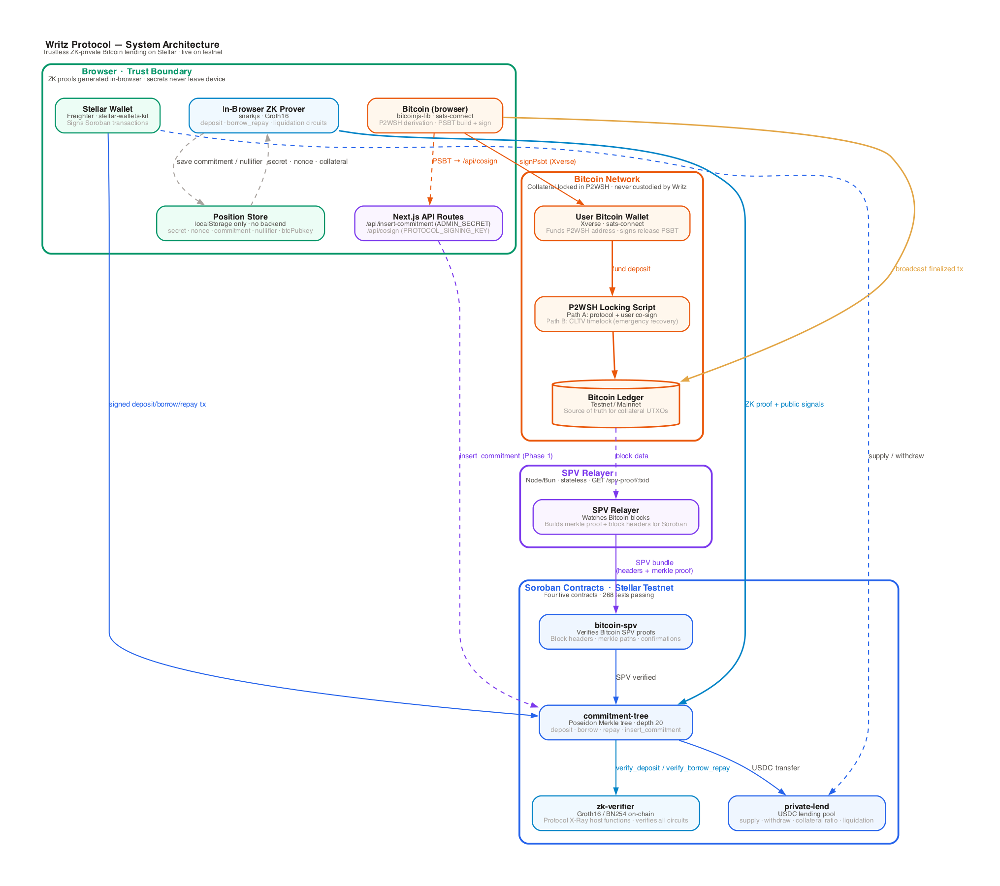
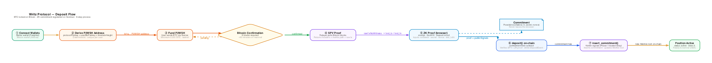
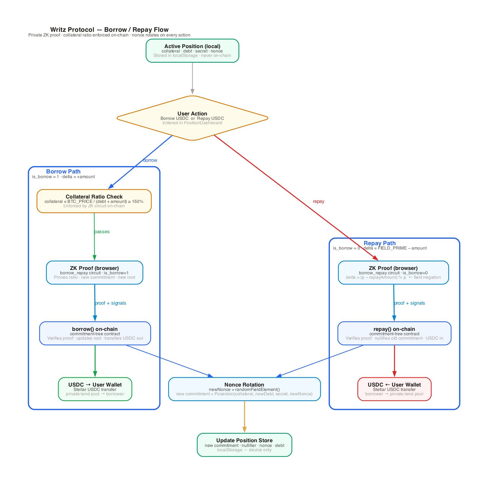
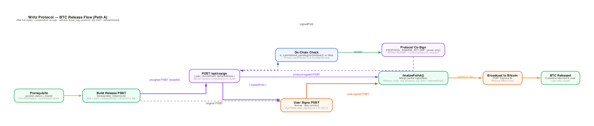
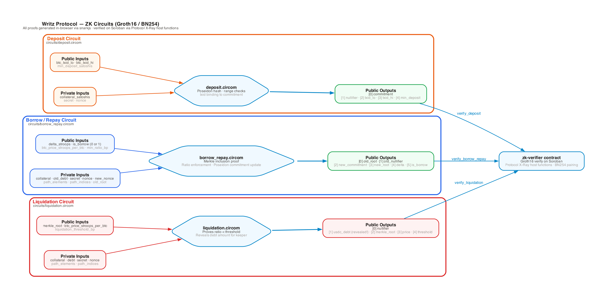
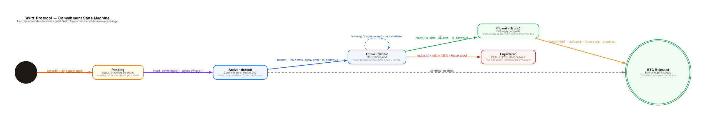
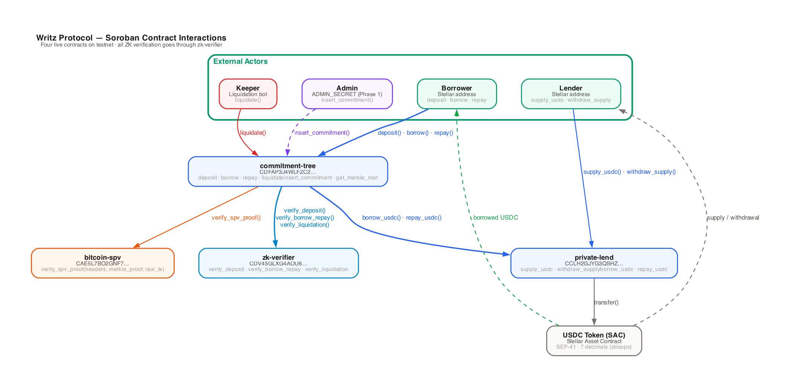
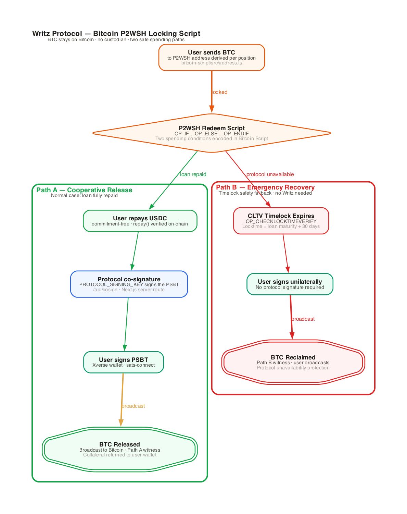
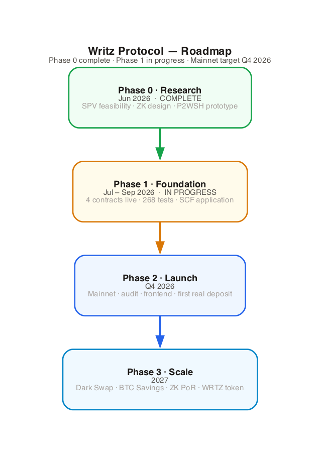

# Writz Protocol

> **Bitcoin was built to be yours. Your loans should be too.**

[](https://github.com/WritzProtocol/writz/actions/workflows/ci.yml?query=branch%3Amain)
[](https://github.com/WritzProtocol/writz/actions)
[](https://stellar.expert/explorer/testnet)
[](LICENSE)

**[Live App](https://writz-protocol.vercel.app)** · **[Docs](https://writz.mintlify.app)** · **[Relayer API](https://writz-relayer-production.up.railway.app)**

**Writz** is the first trustless Bitcoin lending protocol on Stellar. Lock real BTC directly from your Bitcoin wallet, borrow USDC on Stellar, and keep every position private — always.

No bridge. No custodian. No wrapped tokens. No public balance sheet.

---

## What Makes Writz Different

| | Writz | Every other lending protocol |
|---|---|---|
| **Custodian** | Bitcoin Script is the custodian | A company holds your BTC |
| **Privacy** | Private by default · ZK proofs | Your position is a public billboard |
| **BTC** | Native on-chain BTC | Wrapped token (WBTC, tBTC…) |
| **Emergency exit** | CLTV timelock → reclaim alone | Depends on protocol availability |

---

## This Is Not a Whitepaper

As of June 2026, four contracts are live on Soroban testnet, 274 tests pass, and real Bitcoin transactions have been verified on-chain.

| What | Status |
|---|---|
| Bitcoin SPV verification on Soroban | ✅ Live on testnet |
| ZK-private positions (Groth16 BN254) | ✅ Verified on-chain |
| P2WSH locking + co-signed BTC release | ✅ Broadcast on Bitcoin Signet |
| Poseidon Merkle commitment tree | ✅ Root updated on-chain |
| Full deposit → borrow → repay ZK flow | ✅ 6 sequential testnet transactions |
| 274 tests across all modules | ✅ All passing |

### Live Testnet Contracts

| Contract | Address | WASM | Tests |
|---|---|---|---|
| `bitcoin-spv` | `CAE5L7BO2GNF7MIZWXB2BTUMLYNIMQZUSWN2BWLZQS7HRHLOUSL6VLWJ` | 5.2 KB | 47 |
| `zk-verifier` | `CDV45GLXG4AOU6BDZSY5YHHVNGQIAYAPD3PUGXIIIYLIO6V2XGO6SMFV` | 11.8 KB | 18 |
| `commitment-tree` | `CC2OZ3LG5U6RE3U7QC2R5QMID5GHQBE7QXTJQ4ZSTP5W73WDTKQPRW7E` | 26.6 KB | 18 |
| `private-lend` | `CCLH2GJYG3QSHZJI7V7VK3DNMNK3I3QJCECBSFGX3AC6CK4I7EF7ZJ2G` | — | 63 |

Full deployment log, init transactions, and verified calls: [`contracts/deployments/testnet.md`](contracts/deployments/testnet.md)

---

## System Architecture



The protocol operates across two blockchains. Bitcoin is the custody layer — BTC never leaves the Bitcoin network. Stellar is the execution layer — loan logic, privacy, and USDC flows all run on Soroban.

**Four layers, each with a clear boundary:**

1. **Bitcoin Network** — user's BTC wallet locks funds into a P2WSH script. The script enforces two spending conditions; no third party can move the funds.
2. **Backend Services** — a stateless SPV Relayer watches Bitcoin blocks and assembles proof bundles for Soroban. A ZK Prover runs in the browser (no server-side proving).
3. **Soroban Contracts** — four contracts verify Bitcoin transactions cryptographically, verify ZK proofs, manage the Poseidon Merkle tree, and issue/repay USDC loans.
4. **Browser** — all secrets stay on the user's device. ZK proofs are generated locally. The Stellar wallet signs Soroban transactions.

---

## How It Works

### 1 — Deposit & Borrow



1. User connects their Bitcoin wallet (Xverse) and a Stellar wallet (Freighter) to the Writz UI.
2. The frontend derives a unique P2WSH address for this deposit (user public key + protocol public key + timelock).
3. User sends BTC to that address on Bitcoin. The script is now live on-chain.
4. After 6 confirmations, the SPV Relayer assembles a proof bundle: raw transaction, block headers, and Merkle inclusion path.
5. The `bitcoin-spv` Soroban contract verifies the bundle cryptographically — no oracle, no trust.
6. The browser generates a Groth16 ZK proof (deposit circuit): proves BTC was locked and a valid commitment exists, without revealing the amount.
7. The `commitment-tree` contract verifies the ZK proof on-chain and inserts the commitment into the Poseidon Merkle tree.
8. The user can now borrow up to 66% of BTC value in USDC from the `private-lend` pool.

### 2 — Borrow & Repay



Borrowing requires a ZK proof that the position's collateral ratio is above the minimum threshold. The proof reveals nothing about the actual amounts — only that the invariant holds. Repayment rotates the nullifier so the position cannot be double-spent.

### 3 — BTC Release



When the loan is fully repaid, the protocol co-signs a PSBT (Partially Signed Bitcoin Transaction) using its signing key. The user countersigns with their Bitcoin wallet and broadcasts. BTC arrives back in their wallet. The protocol never held custody at any point.

---

## ZK Privacy Layer

Every position is private from the moment of deposit. The Soroban contracts verify loan validity without ever learning the amounts involved.

### What Is Hidden

| Hidden | Visible |
|---|---|
| Collateral amount (BTC) | Total protocol TVL (aggregate) |
| Loan amount (USDC) | Total USDC outstanding (aggregate) |
| Health ratio | That a liquidation occurred (not who/how much) |
| User identity | Merkle tree root |

### Three Groth16 Circuits



- **`deposit.circom`** — Proves BTC was locked and a valid commitment exists. Public output: the commitment hash and the SPV verification result.
- **`borrow_repay.circom`** — Proves the position is sufficiently collateralized for the requested borrow amount, and correctly computes repayment with interest.
- **`liquidation.circom`** — Proves a position's health ratio fell below the liquidation threshold (120%). Anyone can trigger liquidation by providing this proof.

Circuits use Groth16 over BN254. Verification runs on Soroban via Protocol 26 host functions (`bn254.g1_msm`, `bn254.pairing_check`).

### Position Lifecycle



---

## Smart Contract Architecture



| Contract | Purpose | Depends on |
|---|---|---|
| `bitcoin-spv` | SHA256d, PoW validation, checkpoint-anchored difficulty check, Merkle inclusion, block header chain | — |
| `zk-verifier` | Stores Groth16 verification keys; verifies deposit/borrow_repay/liquidation proofs | — |
| `commitment-tree` | Poseidon Merkle tree; core deposit/borrow/repay/liquidate logic, ZK-private | `bitcoin-spv` + `zk-verifier` |
| `private-lend` | USDC lending pool; supply, withdraw, interest rate model, plaintext (non-ZK) positions | `bitcoin-spv` |

**Interest rate model** — kinked curve: base rate + linear slope up to 75% utilization, then a steep slope to discourage over-borrowing. Protocol captures the spread between borrow and supply rates.

**Note on `private-lend` vs. `commitment-tree`:** these are independent, parallel lending implementations against the shared `bitcoin-spv`/`zk-verifier` primitives, not a layered dependency — `private-lend` is the Phase 1 non-private MVP; `commitment-tree` is the ZK-private product described above (see `docs/roadmap/roadmap.md` — "cleaner separation of concerns than embedding into `private-lend`"). Each independently rejects a reused Bitcoin txid before creating a position/commitment — see `docs/security/security-model.md` for how this closes the Merkle duplicate-leaf ambiguity (CVE-2012-2459-class) at the deposit layer.

---

## Bitcoin Script Design



The BTC locking mechanism lives entirely on Bitcoin. The P2WSH redeem script encodes two spending paths:

```
OP_IF
  <protocol_pubkey> OP_CHECKSIGVERIFY
  <user_pubkey>     OP_CHECKSIG
OP_ELSE
  <locktime>        OP_CHECKLOCKTIMEVERIFY OP_DROP
  <user_pubkey>     OP_CHECKSIG
OP_ENDIF
```

**Path A — Cooperative release (normal case):** Both the protocol and user sign. Triggered when the loan is repaid. The Soroban contract issues the co-signature only after verifying repayment on-chain.

**Path B — Emergency recovery (timelock):** After a predefined locktime (loan maturity + 30 days), the user can spend without any protocol involvement. If Writz disappears, the user's funds are never locked forever.

See [`bitcoin-script/`](bitcoin-script/) for the full P2WSH builder, address derivation, and PSBT signing toolkit.

---

## Products

| Product | Description | Status |
|---|---|---|
| **PrivateLend** | Deposit BTC as collateral → borrow USDC privately | Phase 1 — testnet ✅ |
| **Dark Swap** | Convert BTC to USDC directly · no exchange · no visible order | Phase 3 — planned |
| **BTC Savings** | BTC collateral + USDC auto-routed to highest-yield Stellar pools | Phase 3 — planned |
| **ZK Proof of Reserve** | Prove BTC holdings without revealing wallets or amounts · B2B SaaS | Phase 3 — planned |

The **Bitcoin SPV SDK** is also open infrastructure. Any Stellar protocol that needs to verify a Bitcoin transaction on-chain can use `bitcoin-spv` with one call. Writz charges a per-verification fee.

---

## Repository Structure

```
writz/
├── contracts/               # Soroban smart contracts (Rust)
│   ├── contracts/
│   │   ├── bitcoin-spv/     # SHA256d · PoW · Merkle inclusion · block headers
│   │   ├── zk-verifier/     # Groth16 BN254 · verification key store
│   │   ├── commitment-tree/ # Poseidon Merkle tree · ZK lending logic
│   │   └── private-lend/    # USDC pool · interest model · orchestration
│   └── deployments/
│       └── testnet.md       # Live addresses · tx hashes · verified calls
│
├── circuits/                # ZK circuits (Circom 2.2.3 + snarkjs)
│   ├── src/
│   │   ├── deposit.circom
│   │   ├── borrow_repay.circom
│   │   ├── liquidation.circom
│   │   └── merkle.circom
│   └── keys/                # Verification keys (committed to repo)
│
├── relayer/                 # SPV Relayer service (TypeScript · Express · Bun)
│   └── src/
│       ├── routes/proof.ts  # GET /spv-proof/:txid
│       └── bitcoin/         # Esplora client · header fetching · proof assembly
│
├── bitcoin-script/          # Bitcoin locking script toolkit (TypeScript)
│   └── src/
│       ├── script.ts        # P2WSH builder
│       ├── address.ts       # Address derivation (testnet / mainnet)
│       ├── spend.ts         # Path A/B PSBT signing
│       └── keys.ts          # Key management
│
├── frontend/                # Next.js web app (React 19 · TypeScript · Tailwind)
│   └── src/
│       ├── components/      # DepositFlow · PositionDashboard · LenderPanel
│       ├── lib/flows/       # deposit · borrow · repay · recover · lend
│       ├── lib/position/    # Commitment derivation · note encryption
│       └── lib/prover/      # In-browser ZK proof generation (snarkjs)
│
├── packages/
│   └── commitment-tree/     # Generated TypeScript bindings for commitment-tree
│
├── scripts/
│   ├── deploy/              # Deployment scripts · e2e_zkflow.js · set_vkeys.js
│   └── diagrams/            # Graphviz architecture diagrams (Python)
│
└── docs/                    # Full documentation (Mintlify)
```

---

## Tech Stack

| Layer | Technology | Notes |
|---|---|---|
| Smart contracts | Soroban · Rust | Protocol 26 · `soroban-sdk = "26"` |
| ZK proofs | Circom 2.2.3 · snarkjs · Groth16 | BN254 curve · in-browser proving |
| ZK on-chain | Protocol 26 host functions | `bn254.g1_msm` · `bn254.pairing_check` |
| Bitcoin scripting | P2WSH (Phase 1) → Taproot (Phase 3) | `bitcoinjs-lib` · `ecpair` |
| Bitcoin wallets | Xverse · sats-connect | PSBT standard |
| Frontend | Next.js 16 · React 19 · TypeScript | App Router · Tailwind CSS 4 |
| Stellar wallets | Stellar Wallets Kit · Privy | Freighter · Lobstr · email login |
| Relayer runtime | Bun · Express.js | Alpine Docker · Esplora-backed |
| Merkle hashing | Poseidon (poseidon-lite) | Same in circuits + contracts + JS |
| CI | GitHub Actions | 4 parallel jobs · all tests must pass |

---

## Quick Start

### Prerequisites

```bash
# Rust with Soroban WASM target
rustup target add wasm32v1-none
cargo install stellar-cli --locked --version 27  # or later

# Node.js / Bun (for relayer, bitcoin-script, circuits, frontend)
node --version  # >= 20
bun --version   # >= 1.1

# For ZK circuit compilation only.
# circom 2.x is a Rust binary — do NOT `npm install -g circom`, which installs
# the legacy 1.x package and cannot compile `pragma circom 2.0.0`. Grab the
# release binary (CI pins v2.2.3) or build it with cargo:
curl -fL -o ~/.local/bin/circom \
  https://github.com/iden3/circom/releases/download/v2.2.3/circom-linux-amd64
chmod +x ~/.local/bin/circom   # macOS: use circom-macos-amd64
circom --version               # expect: circom compiler 2.2.3
# snarkjs needs no global install — it is already a dependency of circuits/
```

### Run All Tests

Each module has its own toolchain — there is no unifying root build, and the
package manager is **not** the same everywhere. Run them from the repo root:

```bash
# 1. Soroban contracts — 146 tests
cd contracts && cargo test

# 2. Bitcoin script toolkit — 60 tests (Bun's own test runner)
cd ../bitcoin-script && bun install && bun test

# 3. Relayer service — 48 tests
#    Deps install with Bun, but the suite itself is Jest (ts-jest), so it must
#    be run through the package script — plain `bun test` picks Bun's runner
#    instead and fails. The relayer also imports the local @writz/* packages
#    via their built dist/ output, so build those first.
cd ../packages/commitment-tree && bun install
cd ../../bitcoin-script && bun run build
cd ../relayer && bun install && bun run test

# 4. ZK circuits — 20 tests (npm + Jest; needs circom on PATH)
cd ../circuits && npm install && npm test
```

All 274 tests pass. If anything fails, [open an issue](https://github.com/WritzProtocol/writz/issues).

### Full ZK End-to-End on Soroban Testnet

Runs the complete deposit → borrow → repay cycle against the live testnet contracts (6 transactions):

```bash
WRITZ_DEV_SECRET=<your-testnet-key> node scripts/deploy/e2e_zkflow.js
```

Get a free testnet key and fund it with [Stellar Friendbot](https://friendbot.stellar.org).

### Frontend Dev Server

```bash
cd frontend
cp .env.example .env.local
# Fill in NEXT_PUBLIC_* contract addresses from contracts/deployments/testnet.md
# Set NEXT_PUBLIC_RELAYER_URL=https://writz-relayer-production.up.railway.app
bun install && bun dev
# → http://localhost:3000
```

The testnet app is also live at **[writz-protocol.vercel.app](https://writz-protocol.vercel.app)**.

### Generate Architecture Diagrams

```bash
pip install graphviz
python3 scripts/diagrams/render-all.py
# → docs/diagrams/output/*.png + *.svg
```

---

## Test Coverage

| Module | Language | Tests | How to run |
|---|---|---|---|
| `bitcoin-spv` contract | Rust | 47 | `cd contracts && cargo test -p bitcoin-spv` |
| `zk-verifier` contract | Rust | 18 | `cd contracts && cargo test -p zk-verifier` |
| `commitment-tree` contract | Rust | 18 | `cd contracts && cargo test -p commitment-tree` |
| `private-lend` contract | Rust | 63 | `cd contracts && cargo test -p private-lend` |
| Relayer service | TypeScript | 48 | `cd relayer && bun run test` |
| Bitcoin script toolkit | TypeScript | 60 | `cd bitcoin-script && bun test` |
| ZK circuits | Circom / JS | 20 | `cd circuits && npm test` |
| **Total** | | **274** | |

---

## Roadmap



**Phase 1 — Foundation** *(current, Jul–Sep 2026)*

- [x] 4 contracts live on Soroban testnet
- [x] Full ZK E2E cycle verified on-chain
- [x] P2WSH locking and release tested on Bitcoin Signet
- [ ] SCF Build Award submitted (~$92K, Open Track)
- [ ] Trusted setup ceremony planned (5+ independent participants)
- [ ] Mintlify docs live at docs.writz.io

**Phase 2 — Launch** *(Q4 2026)*

- Audit Bank: Veridise (ZK circuits) + OtterSec (Soroban contracts)
- Mainnet launch gated: $50K TVL cap, whitelist-only first 30 days
- Frontend: full deposit / borrow / repay / repay UI with in-browser ZK proving
- DeFiLlama listing on day 1

**Phase 3 — Scale** *(2027)*

- Dark Swap: private BTC → USDC conversions
- BTC Savings: auto-routed USDC yield (Blend, Phoenix DEX)
- ZK Proof of Reserve: enterprise B2B attestation product
- WRTZ governance token: fair IDO at $5M TVL, real-yield buyback mechanics
- SPV SDK published as open Stellar ecosystem infrastructure

---

## Business Model

| Revenue Stream | Mechanism |
|---|---|
| **Lending spread** | Borrow rate minus supply rate on PrivateLend |
| **Swap fees** | Basis points on each Dark Swap conversion |
| **SPV API fees** | Per-verification or subscription for third-party Stellar protocol integrations |
| **Proof of Reserve SaaS** | Monthly subscription for enterprise B2B customers |
| **Insurance fund** | % of all protocol fees auto-routed to an on-chain reserve |

---

## Security

### Risk Model

| Risk | Mitigation |
|---|---|
| Bitcoin reorg | Require 6 confirmations before deposit is recognized |
| P2WSH script bug | Formal review; emergency timelock protects users regardless |
| Protocol key compromise | MPC / HSM co-signing key; key rotation roadmap |
| SPV contract exploit | External audit; stateless approach minimizes attack surface |
| Oracle manipulation | Median of multiple price feeds (Pyth + DIA) |
| ZK proof soundness | Battle-tested Groth16; production ceremony required before mainnet |
| Mass liquidation (BTC crash) | Conservative 150% collateral ratio; open liquidation keeps keepers competitive |

### Audit Roadmap

| Auditor | Scope | Timing |
|---|---|---|
| Veridise | ZK circuits (Circom + proving keys) | After SCF Tranche #1 |
| OtterSec / Zellic | Soroban contracts | After SCF Tranche #2 |
| Internal | Bitcoin P2WSH scripting | Ongoing |

Mainnet launch is gated on zero critical/high findings from both audits.

To report a security issue: open a private [GitHub Security Advisory](https://github.com/WritzProtocol/writz/security/advisories/new).

---

## Documentation

Full documentation lives in [`docs/`](docs/) and is published at **[writz.mintlify.app](https://writz.mintlify.app)**:

**Start here:**
- [What is Writz?](docs/introduction/what-is-writz.md) — Plain English. No jargon. 5 minutes.
- [The Problem](docs/introduction/the-problem.md) — Why public DeFi breaks BTC holders.
- [How Writz Works](docs/introduction/how-writz-works.md) — Full flow for any reader.
- [Why Stellar, Why Now](docs/introduction/why-stellar-why-now.md) — The strategic window.

**Products:**
- [PrivateLend](docs/products/privatelend.md) — Step-by-step user guide.
- [ZK Proof of Reserve](docs/products/zk-proof-of-reserve.md) — The B2B enterprise product.

**How it works (technical):**
- [Bitcoin Side](docs/how-it-works/bitcoin-side.md) — P2WSH locking, spending paths, CLTV.
- [SPV Verification](docs/how-it-works/spv-verification.md) — Trustless Bitcoin tx verification on Soroban.
- [ZK Privacy Layer](docs/how-it-works/zk-privacy-layer.md) — Groth16, Poseidon commitments, what's hidden.
- [Stellar Side](docs/how-it-works/stellar-side.md) — Contracts, interest model, USDC pool.

**Developers:**
- [Quick Start](docs/developers/quick-start.md) — Clone, build, test, deploy.
- [SPV SDK](docs/developers/spv-sdk.md) — Free Bitcoin verification for any Stellar protocol.
- [Contract Reference](docs/developers/contract-reference.md) — All public interfaces.

**Security:**
- [Security Model](docs/security/security-model.md) — What Writz protects and how.
- [Audits](docs/security/audits.md) — Audit roadmap and status.

**Roadmap:**
- [Vision](docs/roadmap/vision.md) — Where Writz is going by 2028.
- [Phases](docs/roadmap/phases.md) — Phase-by-phase execution plan.

---

## Contributing

1. Fork the repo and create a branch from `main`.
2. Run the full test suite before opening a PR — all 274 tests must pass.
3. For new features, add tests. For bug fixes, add a regression test.
4. Open a PR with a clear description of what changed and why.

See [`docs/developers/contribution-guide.md`](docs/developers/contribution-guide.md) for detailed guidelines.

---

## Get Involved

| You are | Start here |
|---|---|
| **BTC holder** who wants to borrow USDC privately | [PrivateLend →](docs/products/privatelend.md) |
| **Developer** who wants to build on the protocol | [Quick Start →](docs/developers/quick-start.md) |
| **Stellar protocol** that needs Bitcoin verification | [SPV SDK →](docs/developers/spv-sdk.md) |
| **Institution** exploring ZK Proof of Reserve | [ZK PoR →](docs/products/zk-proof-of-reserve.md) |

---

## License

MIT
